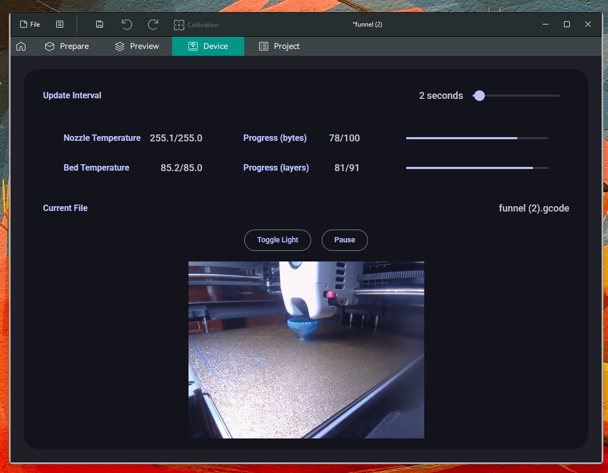

## Usage:

* Download this repository as zip and unzip anywhere.

* Set device UI in orca slicer to `localhost:8080/?printer-ip=<your printer's ip address>`

* Click `run.bat`. This doesn't install anything, it needs to be turned on every time
    you want to see this ui.

* To use this any time you run orca slicer, the `run_with_orca.bat` file starts
both this program and orcaslicer (you may have to edit it if your orca slicer is
not in the default installation location). I've just added a shortcut to this file on my desktop.

## Organization:

`server.py` uses http.server to communicate with the printer and to serve a static website
from the website directory.

npm is on the `website` directory to create the bundle.js file that contains
the material ui library, and to format the files.

The website is mainly on `website/index.html` and `website/update.js`.

To customize theme:

  - Go to [material-web.dev](https://www.material-web.dev)
  - Click the palette icon on the top right.
  - Customize the theme.
  - Click the copy icon next to "Theme Controls".
  - Paste into `theme.css` under the `website` folder.

A roboto font file and style sheet is also included so that the font works
offline. It's taken from google fonts.

## Screenshot:

## To Do:

* use and see if it needs small changes

* time started and time remaining?
  *  I'm not sure where or if the printer supplies this information, so
        this isn't easy to implement.

